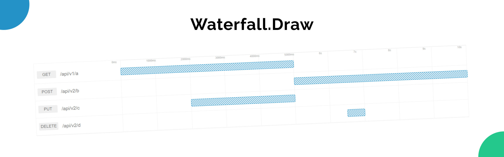

<p align="center">
  
</p>

A simple JavaScript library to draw a waterfall chart of network requests.

### Installation

```
npm i waterfall.draw
```

or

```html
<script type="text/javascript" src="https://unpkg.com/waterfall.draw"></script>
```

Add CSS:

```javascript
import "waterfall.draw/styles.min.css";
```

```html
<link rel="stylesheet" href="https://unpkg.com/waterfall.draw/styles.min.css"></link>
```

### Get Started

```javascript
import waterfall from "waterfall.draw";

const now = new Date().getTime();

const requests = [
	{
		url: "/api/v1/a",
		startedAt: new Date(now),
		endedAt: new Date(now + 5000),
	},
	{
		url: "/api/v2/b",
		startedAt: new Date(now + 5000),
		endedAt: new Date(now + 10000),
	},
	{
		url: "/api/v2/c",
		startedAt: new Date(now + 2000),
		endedAt: new Date(now + 5000),
	},
	{
		url: "/api/v2/d",
		startedAt: new Date(now + 6500),
		endedAt: new Date(now + 7000),
	},
];

waterfall(
    "#elementselector" or document.getElementById('elementselector'),
    requests,
    options
);
```

### Options

To Be Added soon in next version for customisation of styling and functionality.
